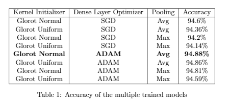

# COMP562-Final-Project

## Main results

### Keypoint detection on COCO validation 2017
<p align="center"> </p>



| Backbone     |  AP       |  FPS         | TensorRT Speed | GFLOPs |Download |
|--------------|-----------|--------------|----------|----------|----------|
|DLA-34        | 62.7      |    23      |  - |  - |[model](https://drive.google.com/open?id=1IahJ3vpjTVu1p-Okf6lcn-bM7fVKNg6N)  |
|Resnet-50     | 54.5     |    28      |  33 |  - |[model](https://drive.google.com/open?id=1oBgWrfigo2fGtpQJXQ0stADTgVFxPWGq)  |
|MobilenetV3   | 46.0      |    30      |  - |  - |[model](https://drive.google.com/open?id=1snJnADAD1NUzyO1QXCftuZu1rsr8095G)  |
|ShuffleNetV2  | 43.9      |    25      |  - |  - |[model](https://drive.google.com/open?id=1FK7YQzCB6mLcb0v4SOmlqtRJfA-PQSvN)  |
|[HRNet_W32](https://drive.google.com/open?id=1mJoK7KEx35Wgf6uAZ-Ez5IwAeOk1RYw0)| 63.8 |    16      |  - |  - |[model](https://drive.google.com/open?id=1X0yxGeeNsD4VwU2caDo-BaH_MoCAnU_J)  |
|[HardNet](https://github.com/PingoLH/FCHarDNet)| 46.0    |    30        | -  |  - |[model](https://drive.google.com/open?id=1CFc_qAAT4NFfrAG8JOxRVG8CAw9ySuYp)  |
|[Darknet53]()| 34.2    |    30        | -  |  - |[model](https://drive.google.com/open?id=1S8spP_QKHqIYmWpfF9Bb4-4OoUXIOnkh)  |
|[EfficientDet]()| 38.2    |    30        | -  |  - |[model](https://drive.google.com/open?id=1S8spP_QKHqIYmWpfF9Bb4-4OoUXIOnkh)  |

## Set up
Upload dataset into `data`. Make sure to maintain two folder subsets for binary classification. Labels are inferred from folder names.
Moidify data paths in `utils/dataloader.py`.

## Evaluation
Download the model in `saved_models/models.txt` into `saved_models`, or train your own.
```
python test.py
```

## Training
Modify the `exp_id` and `log_id` in `train.py`.
```
python train.py
```
